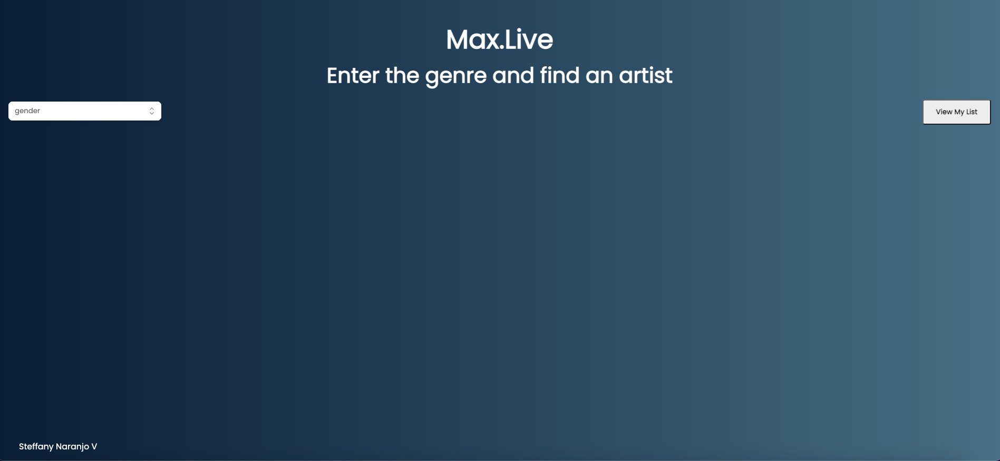
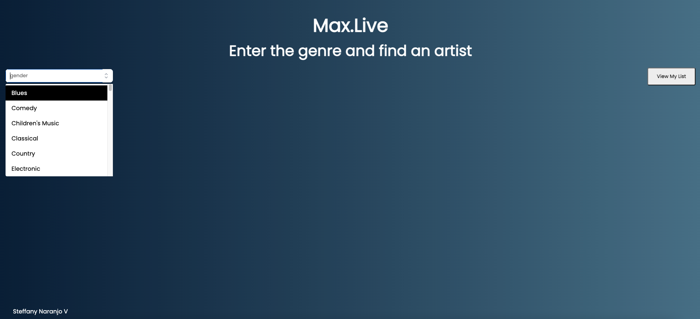
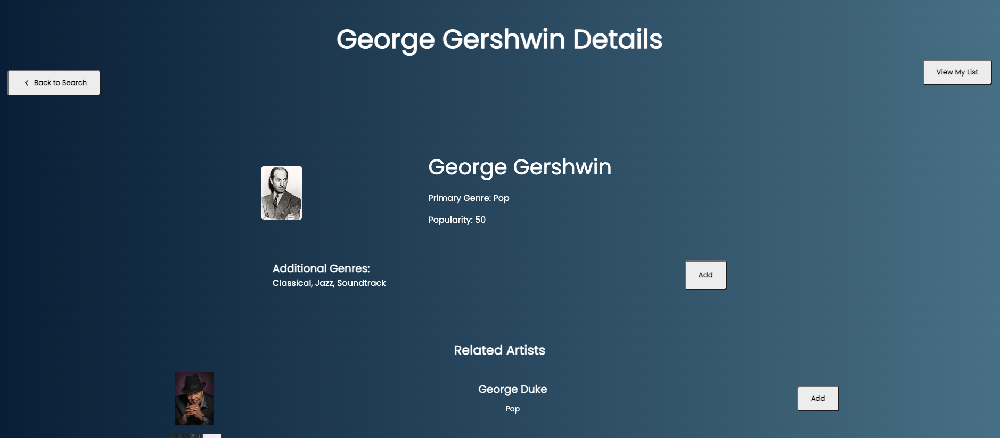
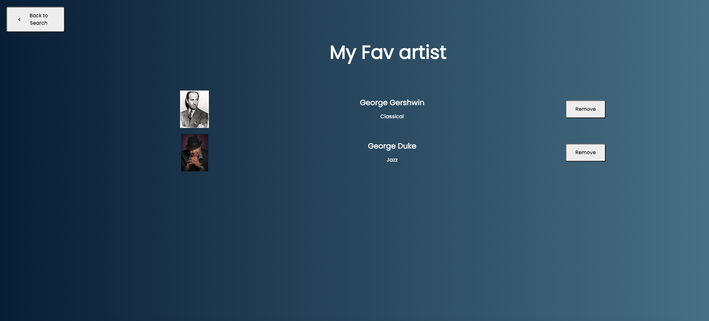

## Overviwe

The project is to build a React application for searching a database of artists via a REST API.
The application should be built as a single-page app and routing should be employed so
that the user may leave and return to the application via the current URL.
The applications should allow a user to:
● Search for artists who play a particular genre of music
● Add an artist from the results to a list of their favorites and then later navigate to the
list
● Click on an artist to see more details about that artist as well as related artists
● Navigate between all the views
The application should have three main views, as described on the following pages. For each
view there are basic wireframes showing the essence of what the page should look like and
demonstrating the functionality.
There are endpoints for any of the data you might need for the application (detailed in the
REST API documentation).

## How to run the project
To run the project you will have to:
1. clone the repository
2. For this project i use yarn so you will have to install yarn
   `npm install --global yarn`
3. Install all the dependencies `yarn install`
4. them run the project with `yarn dev`

## Project view
In the project you wil find:
1. Main page

2. Search Bar lis

3. List Artist

4. My favorite list
